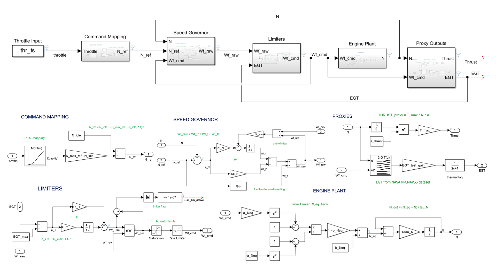
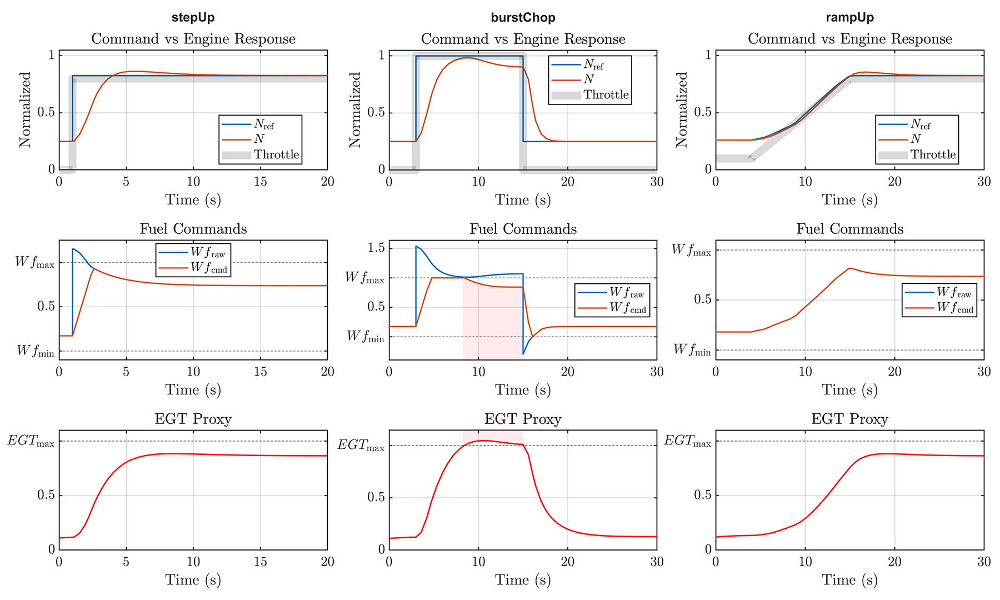

<h1 align="center">
  
  &nbsp; FADEC-SIM &nbsp;
  
</h1>
  

### Engine control simulation in MATLAB/Simulink 

  <a href="#run">Run</a> &nbsp;•&nbsp;
  <a href="#results">Results</a> &nbsp;•&nbsp;
  <a href="#subsystems">Subsystems</a> &nbsp;•&nbsp;
  <a href="#references">References</a>

**Author:** Rodolfo Godinez — Aerospace Engineering Student UC3M ┃ UCSD 

------------------------------------------------------------------------

A FADEC (Full Authority Digital Engine Control) is the onboard computer that commands engine fuel to meet pilot demands while enforcing safety limits. This project builds a simplified FADEC-style controller in MATLAB/Simulink around a generic turbofan-like plant.

The design is guided by the control architecture and terminology described in NASA’s C-MAPSS (Commercial Modular Aero-Propulsion System Simulation).

  

## How to Run
**Requirements:** MATLAB + Simulink **R2024b**  

<table>
  <tr>
    <td><b>Steps:</b></td>
    <td>1) Open MATLAB in the repository root folder 2) Run: <code>main</code></td>
  </tr>
</table>

## Results

  

These plots summarize three standard transients (Step Up, Burst Chop, Ramp Up). 
Top row shows speed reference tracking from input throttle, middle row shows how the raw fuel request is shaped into the final command by limits/rate logic, and bottom row shows the EGT proxy, where EGT stands for Exhaust Gas Temperature.

<h2 id="references">
  References
  
</h2>

This project uses the following two NASA reports as primary references (see `docs/references/`):

- **User’s Guide for the Commercial Modular Aero-Propulsion System Simulation (C-MAPSS)** — *NASA/TM—2007-215026* (Oct 2007)
- **Aircraft Turbine Engine Control Research at NASA Glenn Research Center** — *NASA/TM—2013-217821* (Apr 2013)

