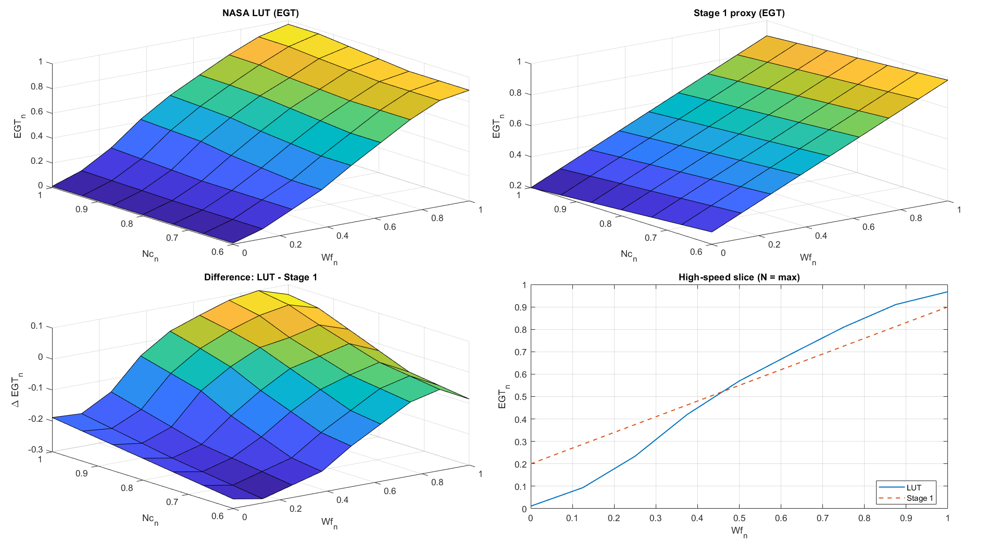

<h1 align="center" style="font-size: 40px; margin: 0;">
  
  &nbsp; FADEC-SIM &nbsp;
  
  
</h1>
  

<b>Simplified engine control system for a generic turbofan </b>

  <a href="#run">Run</a> &nbsp;•&nbsp;
  <a href="#results">Results</a> &nbsp;•&nbsp;
  <a href="#control">Control Structure</a> &nbsp;•&nbsp;
  <a href="#references">References</a>

   Rodolfo Godinez — Aerospace Engineering Student UC3M ┃ UCSD

-------------------------------------------------------------

A **FADEC** (Full Authority Digital Engine Control) is the onboard computer that manages engine fuel 
to meet pilot demand while enforcing safety limits. This project builds a simplified FADEC-style 
controller in MATLAB/Simulink around a generic turbofan plant.

The simulation focuses on engine transient response under throttle changes, combining closed-loop 
control with a nonlinear plant to produce realistic speed, fuel-flow, and temperature trends.

Everything runs in normalized variables, which keeps controller, limiter, and proxy outputs on a 
common scale across test cases.

The design follows the control architecture, terminology, and data from [**NASA's C-MAPSS**](#references).

  

## How to Run

**Requirements** &nbsp;&nbsp;&nbsp;&nbsp;&nbsp;&nbsp;&nbsp;&nbsp;&nbsp;&nbsp;&nbsp;&nbsp;&nbsp;&nbsp;&nbsp;&nbsp;&nbsp;&nbsp;&nbsp;&nbsp;&nbsp;&nbsp;&nbsp;&nbsp;&nbsp;&nbsp;&nbsp;&nbsp;&nbsp;&nbsp;&nbsp;&nbsp;&nbsp;&nbsp;&nbsp;&nbsp;&nbsp;&nbsp;&nbsp;&nbsp;&nbsp;&nbsp;&nbsp;&nbsp;&nbsp;&nbsp;&nbsp;&nbsp;&nbsp;&nbsp;&nbsp;&nbsp;&nbsp;&nbsp;&nbsp;&nbsp;&nbsp;&nbsp;&nbsp;&nbsp;&nbsp;&nbsp; **Steps** 

&nbsp;&nbsp;&nbsp;&nbsp;&nbsp;&nbsp;MATLAB &nbsp;&nbsp;&nbsp;&nbsp;&nbsp;&nbsp;&nbsp;&nbsp;&nbsp;&nbsp;&nbsp;&nbsp;&nbsp;&nbsp;&nbsp;&nbsp;&nbsp;&nbsp;&nbsp;&nbsp;&nbsp;&nbsp;&nbsp;&nbsp;&nbsp;&nbsp;&nbsp;&nbsp;&nbsp;&nbsp;&nbsp;&nbsp;&nbsp;&nbsp;&nbsp;&nbsp;&nbsp;&nbsp;&nbsp;&nbsp;&nbsp;&nbsp;&nbsp;&nbsp;&nbsp;&nbsp;&nbsp;&nbsp;&nbsp;&nbsp;&nbsp;&nbsp;&nbsp;&nbsp;&nbsp;&nbsp;&nbsp;&nbsp;&nbsp;&nbsp;&nbsp;&nbsp;&nbsp;&nbsp;&nbsp;&nbsp;&nbsp;&nbsp;&nbsp;1) Open MATLAB in the repository root folder 
&nbsp;&nbsp;&nbsp;&nbsp;&nbsp;&nbsp;Simulink R2024b &nbsp;&nbsp;&nbsp;&nbsp;&nbsp;&nbsp;&nbsp;&nbsp;&nbsp;&nbsp;&nbsp;&nbsp;&nbsp;&nbsp;&nbsp;&nbsp;&nbsp;&nbsp;&nbsp;&nbsp;&nbsp;&nbsp;&nbsp;&nbsp;&nbsp;&nbsp;&nbsp;&nbsp;&nbsp;&nbsp;&nbsp;&nbsp;&nbsp;&nbsp;&nbsp;&nbsp;&nbsp;&nbsp;&nbsp;&nbsp;&nbsp;&nbsp;&nbsp;&nbsp;&nbsp;&nbsp;&nbsp;&nbsp;&nbsp;&nbsp;&nbsp;&nbsp;&nbsp;&nbsp;&nbsp;&nbsp;2) Run: `main`

`main` runs the default cases and saves figures to `./results/`. &nbsp; Edit `scripts/` to change scenarios or settings. 

## Results

  

 
These plots cover  three standard transients: <b>Step Up, Burst Chop and Ramp Up. </b>

 The <b>top</b> row shows <u>speed</u> reference tracking from input throttle. It compares the demanded spool-speed profile with the simulated engine response, so you can see how the closed-loop system handles each maneuver ;  rise time, settling, and overall tracking quality.

The <b>middle</b> row shows how the raw <u>fuel</u> request is shaped into the final command by limits and rate logic. This is where the protection layer becomes visible, since the controller may briefly ask for more aggressive fuel changes than can be directly applied to the plant. Red shaded intervals mark where the thermal protection is active and fuel is being constrained to prevent further temperature rise.

The <b>bottom</b> row shows the <u>EGT</u> proxy, where EGT stands for Exhaust Gas Temperature. It provides a simple view of the thermal response during each maneuver and shows how temperature rises and settles more gradually than speed or fuel.

## Control Structure

The simulation combines a spool-speed control law with a non-linear turbofan model to get realistic engine transients. Fuel flow is managed through a PI loop with tracking anti-windup, with actuator saturation and rate limiting keeping things within safe physical bounds.

  

 
Following the NASA control philosophy, fuel flow is treated as the main control variable, while spool speed is the main indicator of engine power output. In practice, this means the controller does not send the raw fuel request directly to the plant. Instead, the command is passed through limiter and protection logic so the engine stays stable and doesn't overheat during aggressive throttle changes

 
  

The plant replaces fixed linear constants with a multidimensional map (LUT) built from real-world flight data. This way the simulation captures the actual non-linear curvature and thermal behavior of a modern turbofan more realistically than a single fixed-gain approximation. 

For a block-level view of the complete implementation, see the [model overview](#model).

<h2 id="references">
  References
  
</h2>

This project uses the following NASA reports as primary references (see `docs/references/`):

- **User’s Guide for the Commercial Modular Aero-Propulsion System Simulation (C-MAPSS)** — *NASA/TM—2007-215026* (Oct 2007)
- **Aircraft Turbine Engine Control Research at NASA Glenn Research Center** — *NASA/TM—2013-217821* (Apr 2013)
- **N-CMAPSS_DS02-006.h5** - *Figshare dataset*

  

